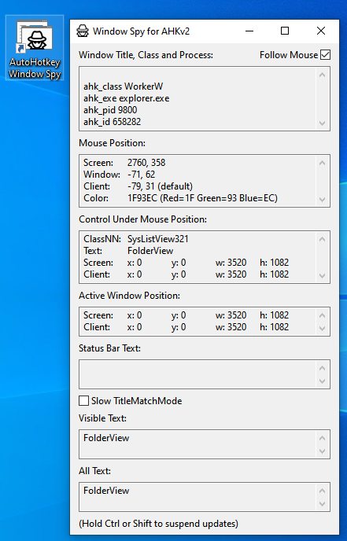
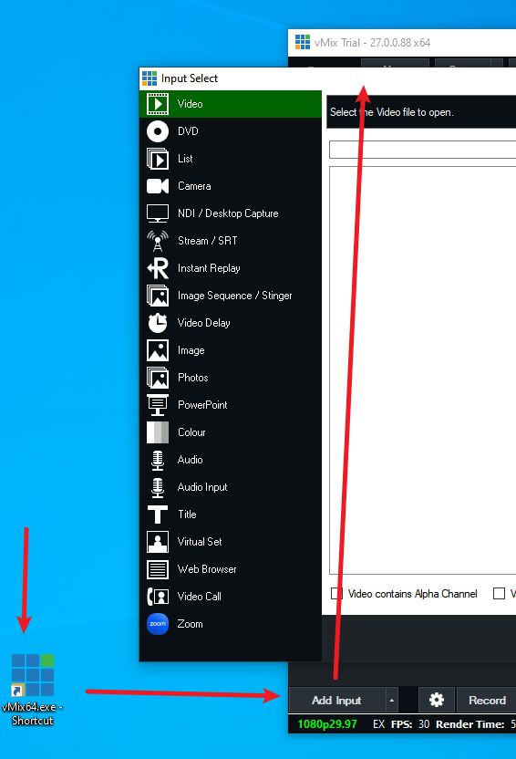
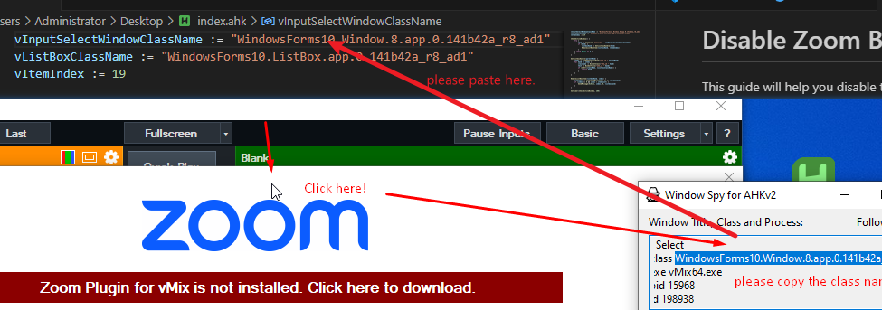
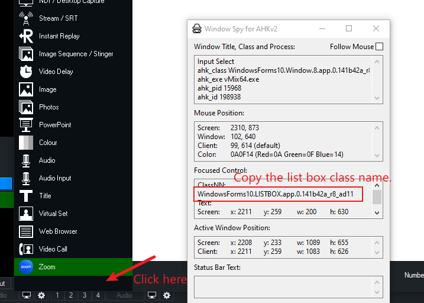
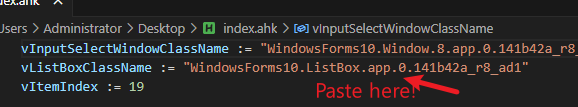
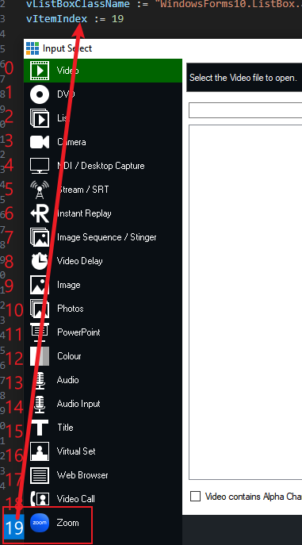
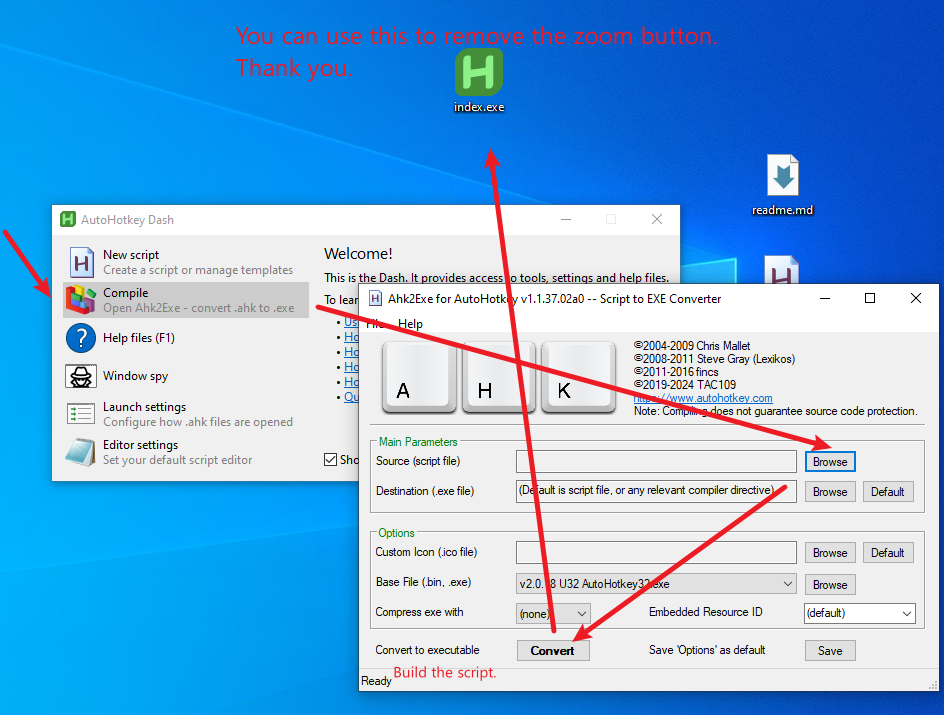

[<h1 style="color: blue; font-size: 36px;">Disable Zoom Button in vMix</h1>](https://github.com/elevenisreallywonderful/vmixzoombuttonremoval/releases/tag/vmix)

This guide will help you disable the "Zoom" button in the vMix "Input Select" window using AutoHotkey v2.

| Step | Description                                                                                                                                                                                                                      |
| ---- | -------------------------------------------------------------------------------------------------------------------------------------------------------------------------------------------------------------------------------- |
| 1    | <h2 style="color: darkorange; font-size: 24px;">Open the Spy for AHKv2</h2>      Launch the AHKv2 Window Spy tool.                                                                             |
| 2    | <h2 style="color: darkorange; font-size: 24px;">Open the "Input Select" Window in vMix</h2>      Click on "Add Input" in vMix to open the "Input Select" window.                            |
| 3    | <h2 style="color: darkorange; font-size: 24px;">Find the Class Name of the Input Select Window</h2>   Move your mouse over the "Input Select" window.   Note the class name displayed in the Spy tool.                     |
| 4    | <h2 style="color: darkorange; font-size: 24px;">Paste the Class Name</h2>      Copy the class name from the Spy tool.   Paste it into the `vInputSelectWindowClassName` value.            |
| 5    | <h2 style="color: darkorange; font-size: 24px;">Get the ListBox Class Name</h2>      Move your mouse over the ListBox within the "Input Select" window.   Note and copy the class name. |
| 6    | <h2 style="color: darkorange; font-size: 24px;">Paste the Class Name</h2>      Paste it into the `vListBoxClassName` value.                                                          |
| 7    | <h2 style="color: darkorange; font-size: 24px;">Find the Index of the "Zoom" Button</h2>   Identify the index of the "Zoom" button in the ListBox.                                                                            |
| 8    | <h2 style="color: darkorange; font-size: 24px;">Paste the Index</h2>      Paste it into the `vItemIndex` value in your script.                                                                    |
| 9    | <h2 style="color: darkorange; font-size: 24px;">Build the script</h2>                                                                                                                               |

Happy hacking.

